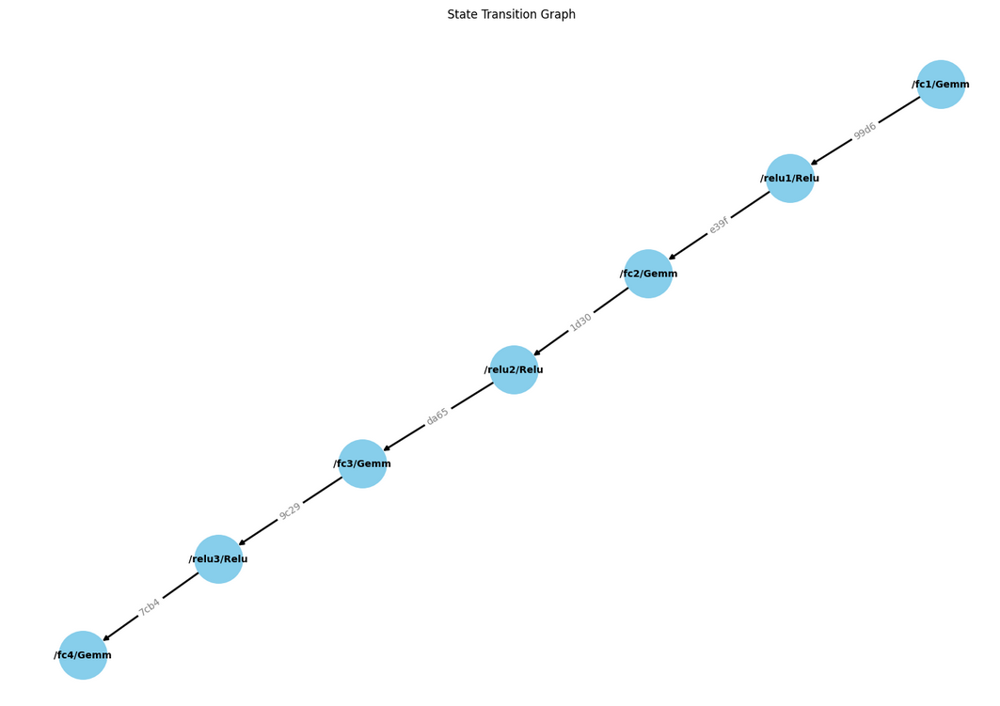

# Veritas

Veritas is a library for verifying inference of large ML models on Mina.

Check out our zkignite proposal [here](https://zkignite.minaprotocol.com/zkignite/dev-tooling-infra-cohort-3_104/funding/suggestion/696/detail).

## Problem

The existing infrastructure of Mina Protocol cannot support large ML models due to significant memory (constraints) and computation (proving time) requirements. This is a blocker for deploying sophisticated ML models such as Llama, Mistral and Stable Diffusion on-chain, which would significantly expand the developer surface area of what can be done on Mina.

## Use-cases

- AI DAO: rather than members of a DAO voting on every little proposal, they would vote to align an LLM that would automatically act on their behalf
- Content provenance for AIGC (AI-Generated Content): right now it's not possible to know if a piece of content was AI generated or real. If we could prove that a piece of content was generated with Stable Diffusion, that would allow us to know that it was AI generated. This would solve the end-to-end content provenance problem. This is a complement to technologies like ZK-microphone (which the team previously worked on, see here: https://github.com/Miyamura80/ZKMicrophone) that prove that a piece of content came from a physical microphone
- AI anomaly detection for smart contract security: If we can bring models on-chain, we can automatically pause smart contracts when anomalous activity is detected. This would allow protocols to integrate an AI-powered security solution that would improve the security of the protocol, and prevent costly hacks
- Sophisticated DeFi pricing / strategies: Current on-chain DEX's are extremely simple and suffer from Impermanent Loss (IL) due to the way that arbitrageurs take advantage of price discrepancies and continuously leave liquidity providers (LPs) on the wrong side of trades (this is known as toxic flow). If we had the price of a pool on a DEX defined by an AI model that took a range of inputs to intelligently adjust the price, we would solve this problem, reducing the impact of impermanent loss on LPs and increasing capital efficiency. More generally, we could bring sophisticated trading strategies on-chain that could for example, automatically manage your portfolio for you in a trustless way, or automatically rebalance an on-chain ETF.
- Trustless on-chain prediction markets: A problem right now with prediction markets is that the resolution process is subjective, often leading to dissatisfied users that disagree with the resolution of a prediction market. With on-chain AI, we can offload the resolution to a model that everyone agrees on before they trade the prediction market. The ML model would take some agreed on inputs (e.g. news article from an oracle) as soon after the market closes, run this through an ML model, and get an answer for the winner.

... and many more we haven't thought of! The general idea is we are increasing the surface area of things developers can do (see https://twitter.com/xanderatallah/status/1750551228788969481)

## Solution

The core idea is to separate the execution of ML inferences from proving. We optimistically execute the ML inference of a model on specialised executors which are optimised for inference. This produces a state transition graph in hash space, which can subsequently be challenged by validators. This can be done in a single step by generating a proof of only the part of the computation that the validator disagrees with, without requiring any interactive proofs. The validator is rewarded in tokens for submitting a valid proof. There is a challenge time, which we estimate to be up to an hour, based on the single verification step. Note that this differs from existing implementation of "optimistic fraud proofs", since the challenge is a single non-interactive step. This is closer to LayerN's approach with Zero-Knowledge Fraud Proofs (zkfp): https://www.layern.com/blog/zkfp

## Architecture

We will use a specialized executor to run inferences with an instrumented version of the onnxruntime - a popular library for ML inference (https://github.com/microsoft/onnxruntime). This version outputs "checkpoints" representing state transitions in hash space at various stages of the inference process.

A major limitation of current zkML libraries based on o1js is running large models. Our library will build on o1js, extending its capabilities to proving large models.

The checkpoints, essentially mappings from input hashes to output hashes, add minimal computational and bandwidth overhead. For instance, a state transition could be a simple operation like ReLu transforming an input tensor into an output tensor, represented as a tuple (partition_id, [hash_of_input_tensor], [hash_of_output_tensor]).

This process creates a state transition graph for each inference that can be efficiently verified. Validators can quickly re-compute and validate these graphs. In case of discrepancies, they generate a ZK fraud proof for only the disputed partition, streamlining the verification process. This approach significantly reduces the proof generation and validation time by focusing on smaller graph partitions.

Here is an example of what a state transition graph looks like for a simple Feed Forward Neural Network (FFNN),
in this case the MNIST model for identifying digits:

